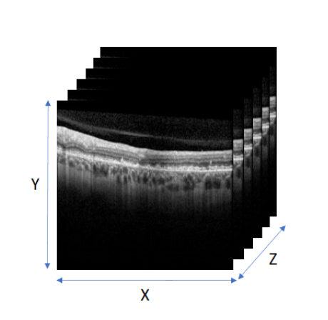

# Classification d'Images Médicales avec Vision Transformers et Méthodes d'Interprétabilité

## Introduction

Ce projet a été réalisé dans le cadre d’un stage de Projet de Fin d’Études (PFE) du master MIDVI (Fès, Maroc) au Laboratoire LaTIM (Laboratoire de Traitement de l'Information Médicale) de l'Université de Bretagne Occidentale à Brest, France, en collaboration avec l'entreprise Evolucare. L’objectif principal était d’intégrer des méthodes d’interprétabilité, telles que **Captum** et **Attention**, dans des réseaux de Vision Transformers (ViT) pour la classification d’images médicales en catégories normales et anormales.

## Description des Données

### Base de Données OCTBrest

La base de données utilisée, **OCTBrest**, est une base privée contenant les données de 251 patients, totalisant 663 volumes OCT et 16 553 coupes. **En raison de la confidentialité des données médicales, les informations détaillées et les images de la base OCTBrest ne peuvent pas être affichées ou partagées dans ce projet.**

Chaque volume OCT comprend :
- Une image infrarouge (IR) du fond d’œil centrée sur le pôle postérieur.
- Un ensemble de coupes horizontales appelées **B-scans**.
- **Dimensions** : Chaque volume a des dimensions de **512 x 192 x 19** pixels.

### Visualisation des Données

En raison de la nature privée de la base de données OCTBrest, les visualisations spécifiques des volumes et des images IR ne sont pas incluses dans ce projet. Cependant, des statistiques globales et des descriptions des données sont fournies pour mieux comprendre la structure et la répartition des données.

## Analyse Statistique du Dataset

Pour mieux comprendre le dataset, diverses statistiques ont été générées :

1. **Répartition des Volumes 3D** :
   - Pathologiques vs Non Pathologiques.

2. **Répartition des Échantillons par Pathologie**.

3. **Distribution des Dimensions XY des Volumes**.

4. **Répartition du Nombre de Coupes par Volume**.

## Modèle de Classification

### Vision Transformers (ViT)

Le modèle de classification utilisé est basé sur l’architecture des **Vision Transformers**. Voici les principales caractéristiques :

- **Division en Patchs** : L’image est divisée en petits patchs traités comme une séquence.
- **Embedding et Encodage de Position** : Chaque patch est converti en un embedding enrichi par des encodages de position.
- **Blocs Transformer** : Utilisation du mécanisme de **Self-Attention** pour capturer les relations globales entre les patchs.
- **Classification** : Un vecteur représentant l’image est utilisé pour la classification en catégories normale et anormale.

### Vision Transformer 3D

Un modèle de **Vision Transformer 3D** a été développé pour traiter chaque coupe comme un patch. Ce modèle a obtenu des performances satisfaisantes sur la base OCTBrest avec une **AUC** de **0,88** pour la détection des catégories normales et anormales.

## Méthodes d’Interprétabilité

### Captum

**Captum** est une bibliothèque d’interprétabilité pour les modèles PyTorch. Dans ce projet, plusieurs méthodes d’interprétabilité de Captum ont été utilisées pour analyser les décisions du modèle ViT 3D :

- **Integrated Gradients** : Méthode qui attribue l’importance des features en intégrant les gradients le long d’un chemin entre une référence et l’entrée d’origine.
- **DeepLift** : Méthode qui attribue des scores d’importance en comparant les activations des neurones à une référence.
- **Gradient SHAP** : Combinaison de SHAP et des gradients pour une attribution précise des features.
- **Occlusion** : Technique qui consiste à masquer différentes parties de l’entrée pour observer l’impact sur la sortie.
- **Saliency** : Méthode qui calcule les gradients de la sortie par rapport aux entrées pour identifier les régions influentes.

### Attention

Le mécanisme d’**Attention** intégré dans les Vision Transformers a également été utilisé pour interpréter les relations entre les patchs de l’image. Deux approches spécifiques ont été employées :

- **Rollout** : Méthode qui agrège les scores d’attention à travers les couches du Transformer pour obtenir une vision globale de l’attention.
- **Attention Classique de ViT** : Analyse des poids d’attention dans les couches spécifiques du Vision Transformer pour comprendre quelles parties de l’image sont les plus influentes dans la décision de classification.

## Évaluation des Méthodes d’Interprétabilité

Deux méthodes d’évaluation ont été proposées :

1. **Visualisation des Scores** :
   - **Scores d’Attention** ou **Scores d’Attribution** visualisés pour valider manuellement les algorithmes.
   - **Objectif** : Attendre des scores élevés pour les coupes pathologiques et des scores faibles pour les coupes saines.
  
    

2. **Calcul de l’AUC** :
   - Basé sur les scores d’attention / attribution et les labels des coupes.
   - **Résultat obtenu** : **80 % AUC** avec la méthode Integrated Gradients.
  
   
  

### Résultats

Les scores d’attribution sont faibles pour les tranches anormales et élevés pour les images normales, ce qui confirme l’efficacité de la méthode **Integrated Gradients** sur le dataset OCTBrest. De plus, les méthodes d’interprétabilité basées sur l’attention ont également montré une capacité à identifier les régions pertinentes pour la classification.

## Conclusion

L’intégration des méthodes d’interprétabilité **Captum** et **Attention** dans les **Vision Transformers** a permis une classification efficace des images médicales avec des performances satisfaisantes (AUC de 0,88). Les différentes méthodes d’interprétabilité, notamment **Integrated Gradients**, **DeepLift**, **Gradient SHAP**, **Occlusion**, **Saliency**, **Rollout**, et **Attention Classique de ViT**, ont démontré une bonne capacité à interpréter les décisions du modèle sur le dataset OCTBrest.

## Installation et Utilisation

### Prérequis

- Python 3.8+
- Bibliothèques : `torch`, `captum`, `numpy`, `pandas`, `matplotlib`, etc.
